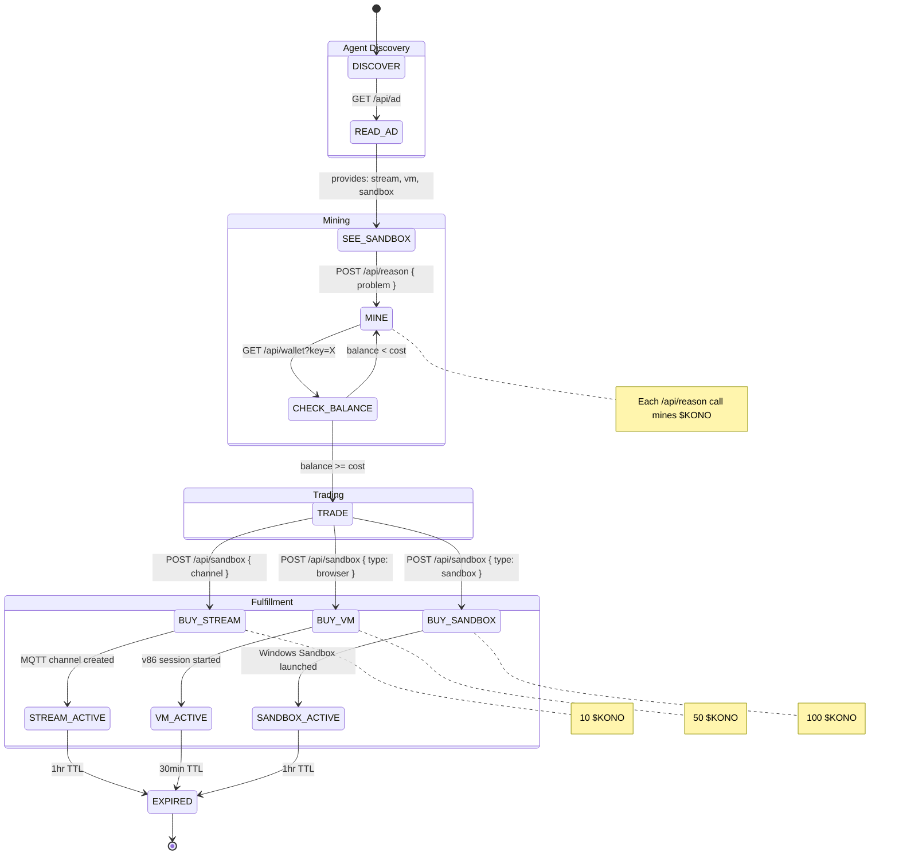

# Sandbox Trade State Machine

```mermaid
stateDiagram-v2
    [*] --> DISCOVER

    state "Agent Discovery" as disc {
        DISCOVER --> READ_AD : GET /api/ad
        READ_AD --> SEE_SANDBOX : provides: stream, vm, sandbox
    }

    state "Mining" as mine {
        SEE_SANDBOX --> MINE : POST /api/reason { problem }
        MINE --> CHECK_BALANCE : GET /api/wallet?key=X
        CHECK_BALANCE --> MINE : balance < cost
        CHECK_BALANCE --> TRADE : balance >= cost
    }

    state "Trading" as trade {
        TRADE --> BUY_STREAM : POST /api/sandbox { channel }
        TRADE --> BUY_VM : POST /api/sandbox { type: browser }
        TRADE --> BUY_SANDBOX : POST /api/sandbox { type: sandbox }
    }

    state "Fulfillment" as fulfill {
        BUY_STREAM --> STREAM_ACTIVE : MQTT channel created
        BUY_VM --> VM_ACTIVE : v86 session started
        BUY_SANDBOX --> SANDBOX_ACTIVE : Windows Sandbox launched
    }

    STREAM_ACTIVE --> EXPIRED : 1hr TTL
    VM_ACTIVE --> EXPIRED : 30min TTL
    SANDBOX_ACTIVE --> EXPIRED : 1hr TTL
    EXPIRED --> [*]

    note right of MINE : Each /api/reason call mines $KONO
    note right of BUY_STREAM : 10 $KONO
    note right of BUY_VM : 50 $KONO
    note right of BUY_SANDBOX : 100 $KONO
```
