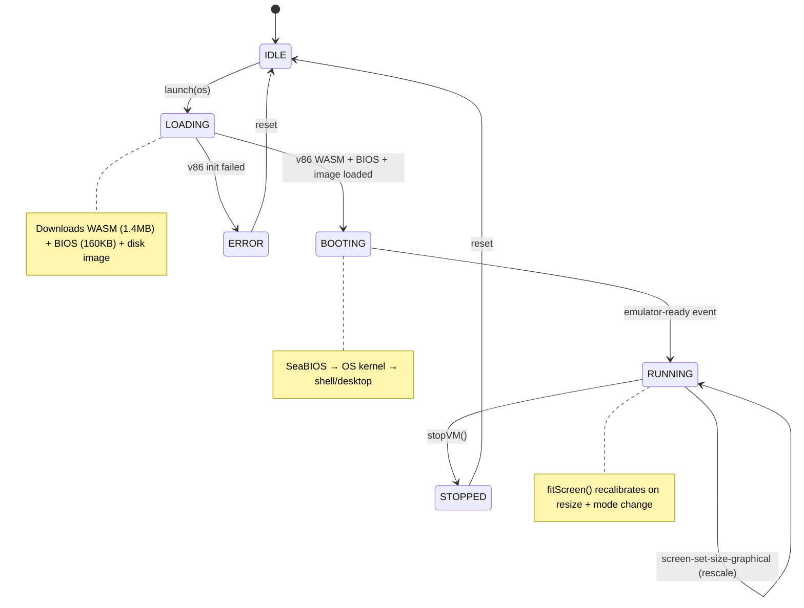

# VM Lifecycle State Machine

```mermaid
stateDiagram-v2
    [*] --> IDLE

    IDLE --> LOADING : launch(os)
    LOADING --> BOOTING : v86 WASM + BIOS + image loaded
    BOOTING --> RUNNING : emulator-ready event
    RUNNING --> STOPPED : stopVM()
    STOPPED --> IDLE : reset

    RUNNING --> RUNNING : screen-set-size-graphical (rescale)
    LOADING --> ERROR : v86 init failed
    ERROR --> IDLE : reset

    note right of LOADING : Downloads WASM (1.4MB) + BIOS (160KB) + disk image
    note right of BOOTING : SeaBIOS → OS kernel → shell/desktop
    note right of RUNNING : fitScreen() recalibrates on resize + mode change
```
